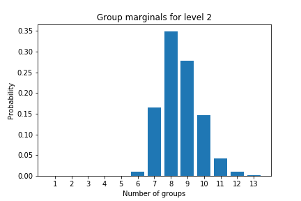
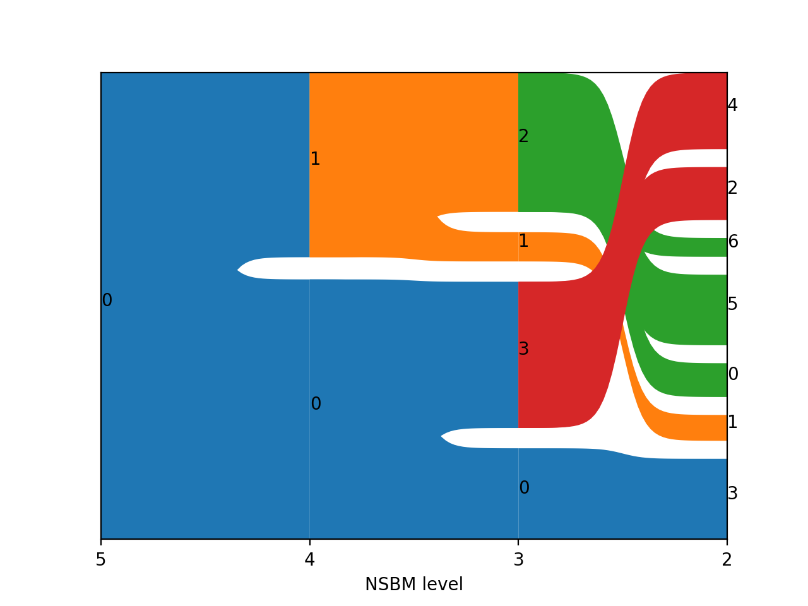
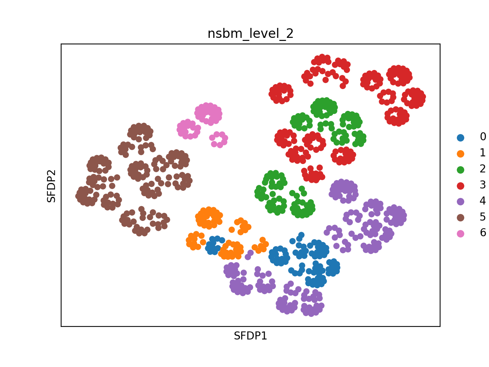

 


# SCHIST
An interface for Nested Stochastic Block Model for single cell analysis.

## Quick start
### Status
- Version 0.5.2 Fast model for NSBM (and PP).
- Version 0.5.0 Introduces Planted Partition model
- Version 0.4.2 Introduces functions to calculate cluster consistency.
- Version 0.4.0 Some bugfixes and name change to `schist`
- Version 0.3.1 It is possible to resume operatons on a previously modeled state (i.e. you can do two step analysis)
- Version 0.3.0 Major changes in the way MCMC is performed. SBM is also available.
- Version 0.2.5 extends `scanpy.tools.draw_graph` layouts to the ones available in `graph-tool` library
- Version 0.2 The code for the interface is mature. It is also possible to read/write objects
- Version 0.1 implements a working interface to `graph-tool` library for `scanpy`


### How to use
Once `schist` has been installed, it can be used out of the box on `scanpy` objects:

```python
from schist.inference import nested_model

nested_model(adata)
```

Once the MCMC has converged, the `adata.obs` object will contain additional columns for multiple levels, named `nsbm_level_1`, `nsbm_level_2` and so on (by default up to `nsbm_level_10`). 

### Installation
The key component (`graph-tool`) is not available through pip and requires extra compilation by the user, refer to its [installation page](https://git.skewed.de/count0/graph-tool/-/wikis/installation-instructions). Note, however, that a conda package is available from conda-forge, that means you may install it (and `schist` dependencies) just issuing

```
conda create -n schist -c conda-forge -c bioconda numpy scipy anndata pandas 'graph-tool>=2.33' scanpy
conda activate schist
```

After that, `schist` can be installed from source:

```
git clone https://github.com/dawe/schist.git
cd schist
pip install .
```


### Known issues
#### Saving objects
`schist` allows to return the `NestedBlockState` object in `adata.uns['nsbm']['state']` slot. Unfortunately, this object cannot be dumped into `.h5ad` files by the `sc.write()` function. If you returned the state, e.g. for debugging, you should pop it out from your dataset before writing:

```python
state = adata.uns['nsbm'].pop('state')
adata.write('myfile.h5ad')

## save the state separately
import pickle
with open('state.pkl', 'wb') as pkl_state:
    pickle.dump(state, pkl_state, 2)
```

Since version 0.2 it is possible to save `AnnData` objects like above simply issuing

```python
schist.io.write(adata, prefix='myfile')
```

This will create two files: `myfile.h5ad`, containing the actual `AnnData`, and 
`myfile.pkl` containing the pickled state. With the same logic, assuming the two files
are in the same place, issuing

```python
adata = schist.io.read('myfile')
```

will read the `.h5ad` and the `.pkl` files and create the proper `AnnData` object

## Introduction

### Understanding NSBM

`schist` is based on Nested Stochastic Block Models (NSBM), a generative process based on the notion of group of nodes. Here, we use NSBM to cluster cells in scRNA-seq experiments.

#### Bayesian approach
Cell to cell relations are commonly represented as a neighborhood graph (typically KNN or  SNN), cell groups are identified as graph communities, this step is usually performed maximising graph modularity. In `schist`, instead, partitioning is performed maximising the  Bayesian posterior probability **P(b|A)**, that is the likehood of generating a network _A_ with a partition _b_ and it is obtained according to 


Where **P(A|θ,b)** is the probability of obtaining the network _A_ given the partition _b_ and additional parameters _θ_; **P(θ,b)** is the probability of occurrence of the partition _b_ having observed the netwok _A_; **P(A)** is the “model evidence” and it is the same for all possible partitions. Refer to the excellent [`graph-tool` documentation](https://graph-tool.skewed.de/static/doc/demos/inference/inference.html) for more details. Note that maximising this quantity is equivalent to minimizing the entropy


The nested model introduces a hierarchy of priors used to infer the optimal recursive grouping of single cell groups. If you are familiar with Leiden or Louvain methods to find cell groups, you may think at this multilevel approach as a multiresolution one, except that it is not. Here, not only the cell groups at each hierarchy level are found maximising the equation above, but the hierarchy itself (hence the groups of groups) is part of the model.
Since there may be more than one fit with similar probability, `schist` uses the `graph-tool` routines to apply a Markov chain Monte Carlo sampling of the posterior distribution aiming to converge to the best model. 
One of the main limitations of `schist` is that it requires significantly more time than any other state of the art approach to identify cell groups. This cost comes with the benefit that it is possible to choose between different parameters according to the likelihood of a partition set to be found over a network.

#### Fast model vs standard approach

In the standard approach, the model is initialized by minimizing the description length (entropy). This requires extra time but, in general, returns better results. It is possible to achieve good results with lower memory footprint and in shorter times settting `fast_model`:

```python
nested_model(adata, fast_model=True)
```

This will seed the model with a dummy partition scheme, then a greedy merge-split MCMC will explore solutions until it converges.

#### Marginals

When using the following invocation 

```python
nested_model(adata, collect_marginals=True, equilibrate=True)
```

an additional step (with fixed number of iterations) is added to execution. During this step, `schist` collects the probability of having a certain number of groups for each level of the hierarchy. These are stored into `adata.uns['nsbm']['group_marginals']`:

```python
level = 2
S = adata.uns['nsbm']['group_marginals'][level].sum()
p = adata.uns['nsbm']['group_marginals'][level] / S
ng = range(1, len(p) + 1)
bar(ng, p)
xticks(ng)
xlabel('Number of groups')
ylabel('Probability')
title(f'Group marginals for level {level}')
```

<div align=center>

</div>

Prior to version 0.3.4, this option would have collected posterior probabilities of cells to belong to a certain group. Since this quantity is interesting and it would have required a long time to compute, we'd rather calculate variation of global entropy by moving all cells to all identified groups and transform that into a probaility, which is now stored into `adata.uns['nsbm']['cell_affinity']`. Here, a dictionary keyed with NSBM levels counts the times a cell has been successfully moved to a group. These probabilities can be efficiently used as covariates when looking for marker genes, this approach will weight the belief that a cell belongs to a group. We have prepared a [notebook](https://github.com/dawe/schist-notebooks/blob/master/Cell_Marginals.ipynb) showing an example.

## Function

### Inference

#### schist.inference.nested_model
```
schist.inference.nested_model(adata, max_iterations, epsilon, equilibrate, wait, nbreaks, collect_marginals, niter_collect, hierarchy_length, deg_corr, multiflip, fast_model, fast_tol, n_sweep, beta, n_init, beta_range, steps_anneal, resume, restrict_to, random_seed, key_added, adjacency, neighbors_key, directed, use_weights, prune, return_low, copy, minimize_args, equilibrate_args)
```
Cluster cells using the nested Stochastic Block Model [Peixoto14], a hierarchical version of Stochastic Block Model [Holland83], performing Bayesian inference on node groups. NSBM should circumvent classical limitations of SBM in detecting small groups in large graphs replacing the noninformative priors used by a hierarchy of priors and hyperpriors.

This requires having ran `scanpy.pp.neighbors` or `scanpy.external.pp.bbknn` first.

**Parameters**

**adata** : The annotated data matrix.
    
**max_iterations** : Maximal number of iterations to be performed by the equilibrate step.
    
**epsilon** : Relative changes in entropy smaller than epsilon will not be considered as record-breaking.
    
**equilibrate** : Whether or not perform the mcmc_equilibrate step. Equilibration should always be performed. Note, also, that without equilibration it won't be possible to collect marginals.
    
**collect_marginals** : Whether or not collect node probability of belonging to a specific partition.
    
**niter_collect** : Number of iterations to force when collecting marginals. This will increase the precision when calculating probabilites.
    
**wait** : Number of iterations to wait for a record-breaking event. Higher values result in longer computations. Set it to small values when performing quick tests.
    
**nbreaks** : Number of iteration intervals (of size `wait`) without record-breaking events necessary to stop the algorithm.
    
**hierarchy_length** : Initial length of the hierarchy. When large values are passed, the top-most levels will be uninformative as they will likely contain the very same groups. Increase this valus if a very large number of cells is analyzed (>100.000).
    
**deg_corr** :Whether to use degree correction in the minimization step. In many real world networks this is the case, although this doesn't seem the case for KNN graphs used in scanpy.
    
**multiflip** : Whether to perform MCMC sweep with multiple simultaneous moves to sample network partitions. It may result in slightly longer runtimes, but under the hood it allows for a more efficient space exploration.
    
**fast_model** : Whether to skip initial minization step and let the MCMC find a solution. This approach tend to be faster and consume less memory, but may be less accurate.
    
**fast_tol** : Tolerance for fast model convergence.
    
**n_sweep** : Number of iterations to be performed in the fast model MCMC greedy approach.
    
**beta** : Inverse temperature for MCMC greedy approach.
    
**n_init** : Number of initial minimizations to be performed. The one with smaller  entropy is chosen.
    
**beta_range** : Inverse temperature at the beginning and the end of the equilibration.
    
**steps_anneal** : Number of steps in which the simulated annealing is performed.
    
**resume** : Start from a previously created model, if any, without initializing a novel model.    
   
**key_added** :  `adata.obs` key under which to add the cluster labels.
   
**adjacency** : Sparse adjacency matrix of the graph, defaults to `adata.uns['neighbors']['connectivities']` in case of scanpy<=1.4.6 or `adata.obsp[neighbors_key][connectivity_key]` for scanpy>1.4.6.
   
**neighbors_key** : The key passed to `sc.pp.neighbors`.
   
**directed** :  Whether to treat the graph as directed or undirected.
   
**use_weights** :  If `True`, edge weights from the graph are used in the computation (placing more emphasis on stronger edges). Note that this increases computation times.
   
**prune** : Some high levels in hierarchy may contain the same information in terms of cell assignments, even if they apparently have different group names. When this option is set to `True`, the function only returns informative levels. Note, however, that cell affinities are still reported for all levels. Pruning does not rename group levels.
   
**return_low** : Whether or not return nsbm_level_0 in adata.obs. This level usually contains so many groups that it cannot be plot anyway, but it may be useful for particular analysis. By default it is not returned
    
**copy** : Whether to copy `adata` or modify it inplace.
   
**random_seed** : Random number to be used as seed for graph-tool.

**Returns**

**`adata.obs[key_added]`** :  Array of dim (number of samples) that stores the subgroup id (`'0'`, `'1'`, ...) for each cell. 
   
**`adata.uns['nsbm']['params']`** : A dict with the values for the parameters `resolution`, `random_state`,and `n_iterations`.
   
**`adata.uns['nsbm']['stats']`** : A dict with the values returned by mcmc_sweep
    
**`adata.uns['nsbm']['cell_affinity']`** : A `np.ndarray` with cell probability of belonging to a specific group
    
**`adata.uns['nsbm']['state']`** :The NestedBlockModel state object

#### schist.inference.planted_model
```
schist.inference.planted_model(adata, n_sweep, beta, tolerance, max_iterations, epsilon, equilibrate, wait, nbreaks, collect_marginals, niter_collect, deg_corr, n_init, beta_range, steps_anneal, resume, restrict_to, random_seed, key_added, adjacency, neighbors_key, directed, use_weights, copy, minimize_args, equilibrate_args)
```

Cluster cells using the  Stochastic Block Model [Peixoto14], performing Bayesian inference on node groups. This function, in particular, uses the Planted Block Model, which is particularly suitable in case of assortative graphs and it returns the optimal number of communities

This requires having ran `scanpy.pp.neighbors` or `scanpy.external.pp.bbknn` first.

**Parameters**

**adata** : The annotated data matrix.
    
**n_sweep** : Number of MCMC sweeps to get the initial guess.
    
**beta** : Inverse temperature for the initial MCMC sweep.        
    
**tolerance** : Difference in description length to stop MCMC sweep iterations.        
    
**max_iterations** : Maximal number of iterations to be performed by the equilibrate step.
    
**epsilon** : Relative changes in entropy smaller than epsilon will not be considered as record-breaking.
    
**equilibrate** : Whether or not perform the mcmc_equilibrate step. Equilibration should always be performed. Note, also, that without equilibration it won't be possible to collect marginals.
    
**collect_marginals** : Whether or not collect node probability of belonging to a specific partition.
    
**niter_collect** : Number of iterations to force when collecting marginals. This will increase the precision when calculating probabilites
    
**wait** : Number of iterations to wait for a record-breaking event. Higher values result in longer computations. Set it to small values when performing quick tests.
    
**nbreaks** : Number of iteration intervals (of size `wait`) without record-breaking events necessary to stop the algorithm.
    
**deg_corr** : Whether to use degree correction in the minimization step. In many real world networks this is the case, although this doesn't seem the case for KNN graphs used in scanpy.
    
**n_init** : Number of initial minimizations to be performed. The one with smaller entropy is chosen.
    
**beta_range** : Inverse temperature at the beginning and the end of the equilibration.
    
**steps_anneal** : Number of steps in which the simulated annealing is performed.
    
**resume** : Start from a previously created model, if any, without initializing a novel model.    
    
**key_added** : `adata.obs` key under which to add the cluster labels.
    
**adjacency** : Sparse adjacency matrix of the graph, defaults to `adata.uns['neighbors']['connectivities']` in case of scanpy<=1.4.6 or `adata.obsp[neighbors_key][connectivity_key]` for scanpy>1.4.6.
    
**neighbors_key** : The key passed to `sc.pp.neighbors`.
    
**directed** : Whether to treat the graph as directed or undirected.
   
**use_weight** : If `True`, edge weights from the graph are used in the computation (placing more emphasis on stronger edges). Note that this increases computation times.
   
**copy** :Whether to copy `adata` or modify it inplace.
    
**random_seed** : Random number to be used as seed for graph-tool.

**Returns**

**`adata.obs[key_added]`** :  Array of dim (number of samples) that stores the subgroup id (`'0'`, `'1'`, ...) for each cell.
    
**`adata.uns['sbm']['params']`** : A dict with the values for the parameters `resolution`, `random_state`, and `n_iterations`.
    
**`adata.uns['sbm']['stats']`** : A dict with the values returned by mcmc_sweep
    
**`adata.uns['sbm']['cell_affinity']`** : A `np.ndarray` with cell probability of belonging to a specific group
    
**`adata.uns['sbm']['state']`** : The BlockModel state object

### Tools

#### schist.tools.cluster_consistency
```
schist.tl.cluster_consistency(adata, level, group, key, copy)
```

Calculate cluster consistency at a given level

**Parameters**

**adata** : Annotated data matrix. 
    
**level** : The NSBM level, as an alternative of full group name.
    
**group** : The name of the NSBM level for which consistency should be calculated.

**key** : The key used to store NSBM groupings.
    
**copy** : Return a copy instead of writing to adata.
   
**Returns**

 Depending on `copy`, returns or updates `adata` with consistency values in adata.uns['cluster_consistency'] and adata.obs['cluster_consistency']


#### schist.tools.cell_stability
```
schist.tl.cell_stability(adata, key, copy)
```

**Parameters**

**adata** : Annotated data matrix.

**key** : The key used to store NSBM groupings.

**copy** : Return a copy instead of writing to adata.

**Returns**

Depending on `copy`, returns or updates `adata` with stability values in adata.obs['cell_stability'].

#### schist.tools.draw_graph
```
schist.tl.draw_graph(adata, layout, use_tree, random_seed, adjacency, key_added_ext, key, copy, **kwds)
```

Extends scanpy.tools.draw_graph function using some layouts available in  graph-tool library. Three layouts are available here:
    
 - SFDP spring-block layout.
 - ARF spring-block layout.
 - Fruchterman-Reingold spring-block layout.
    
Fruchterman-Reingold is already available in scanpy, but here can be used to render the nested model tree. 
    
In order to use these plotting function, the NestedBlockState needs to be saved when building the model, so `save_state=True` needs to be set.

**Parameters**

**adata** : Annotated data matrix. A NestedBlockState object needs to be saved
    
**layout** : A layout among 'sfdp', 'fr' or 'arf'. Other graph-tool layouts haven't been implemented.
   
**use_tree** : When this is set, the tree of the nested model is used to generate layout, otherwise the layout only accounts for the neighborhood graph.    
    
**random_seed** : Random number to be used as seed for graph-tool.
    
**adjacency** : Sparse adjacency matrix of the graph, defaults to `adata.uns['neighbors']['connectivities']`.
    
**key_added_ext** : By default, append `layout`.
    
**key** : The slot in `AnnData.uns` containing the state. Default is 'nsbm'.
    
**copy** :Return a copy instead of writing to adata.
   
** kwds ** : Parameters of chosen igraph layout. See e.g. `fruchterman-reingold`. One of the most important ones is `maxiter`.

**Returns**
   
Depending on `copy`, returns or updates `adata` with the following field:

**X_draw_graph_layout** : `adata.obsm`. Coordinates of graph layout. E.g. for layout='fa' (the default), the field is called 'X_draw_graph_fa'.


#### schist.tools.select_affinity
```
schist.tl.select_affinity(adata, level, threshold, inverse, key, update_state, filter, copy)
```

Selects cells based on the affinity values at a specified level.

**Parameters**

**adata** : Annotated data matrix. A NestedBlockState object needs to be saved.
    
**level** : The level to be used for selection.

**threshold** : The maximal affinity to be used. Cells with affinities lower than the threshold will be discarded.
    
**inverse** : Whether to return cells with affinity lower than the threshold.
    
**key** : key of the `adata.uns` slot storing the affinities.
    
**update_state** : Whether to update the state removing unselected cells.
    
**filter** :If False, cells are not filtered and only marked in `adata.obs['selected']`.
    
**copy** : Whether to perform selection in place or return a subsetted object.
   
**Returns**
    
Depending on `copy`, returns or updates `adata` with selected cells.


### Plotting
#### schist.pl.alluvial
```
schist.pl.alluvial(adata, level_start, level_end, key, gap)
```
Generate an alluvial plot for NSBM hierarchy.
This plot may be useful to study the hierarchical relations in a Nested Model generated by `scnbsm.inference.nested_model`.

**Parameters**

**adata** : The annotated data matrix.

**level_start** : The deepest level in the hierarchy (i.e. the one with more clusters). Note that this parameter marks the leafs of the tree.

**level_end** : The coarser level in hierarchy. Default value is `None`, if pruning has not been performed, it may be useful to exclude uninformative levels anyway. Note that this parameter marks the root of the tree

**key** : The key used to group cells. Default is `nsbm`.

**gap** : The gap between groups in percentage.

#### schist.pl.draw_tree

```
schist.pl.draw_tree(adata, level, color, color_map, key, save)
```
Plots NSBM hierarchy using graph-tool capabilities.

**Parameters**

**adata** : The annotated data matrix.

**level** : The NSBM level to be plot.

**color** : The `adata.obs` property used to generate color. It is mutually exclusive with `level` option. 

**color_map** : Th colormap to use for continuous colors.

**save** : Name of the output file. If a non interactive notebook is detected, this parameter is automatically set.

**key** : The key used to perform nsbm.

### Utils

#### schist.io.write
```
schist.io.write(adata, prefic, key, h5ad_fname, pkl_fname)
```
Save anndata object when a NestedBlockState has been retained during inference. The `state` object is stripped out the `adata.uns` and saved as pickle separately.

**Parameters**

**adata** : The AnnData object to be saved.

**prefix** : The prefix for .h5ad and .pkl files. Two files (prefix.h5ad, prefix.pkl) will be saved.

**key** : The slot in `AnnData.uns` in which nsbm information is placed.

**h5ad_filename** : Specify a file name for AnnData.

**pkl_filename** : Specify a file name for `state` pickle.

#### schist.io.read
```
schist.io.read(prefic, key, h5ad_fname, pkl_fname)
```
Read anndata object when a NestedBlockState has been saved separately. This function reads the h5ad and the pkl files, then rebuilds the `adata` properly, returning it to the user. Note that if pkl is not found, an AnnData object is returned anyway.

**Parameters**

**prefix** : The prefix for .h5ad and .pkl files, it is supposed to be the same for  both. If this is not, specify file names (see below).

**key** : The slot in `AnnData.uns` in which nsbm information is placed.

**h5ad_filename** : If `prefix` is not shared between h5ad and pkl, specify the h5ad file here.

**pkl_filename** : If `prefix` is not shared between h5ad and pkl, specify the pkl file here.


## Plotting
### Alluvial Plots
`schist` provides an interface to `graph-tool` to infer Nested Stochastic Block Models from single cell data in `scanpy`. Once models are built, data are partitioned in multiple groups, linked together in hierarchical way. In order to represent a hierarchy, `schist` implements a simple plot function that represents data using alluvial plots:

```python
adata = schist.io.read('adata')
schist.pl.alluvial(adata)
```

<div align=center>

</div>

This function will plot all levels in hierarchy by default. As many level are uninformative, they can be excluded from the plot

```python
adata = schist.io.read('adata')
schist.pl.alluvial(adata, level_end=5)
```
<div align=center>

</div>

Leaf levels can be also excluded

```python
adata = schist.io.read('adata')
schist.pl.alluvial(adata, level_end=5, level_start=2)               
```
<div align=center>

</div>

### Extending `sc.tl.draw_graph()`

`graph-tools` has built-in functionalities to plot graphs. Some of these have been implemented into `schist` using a syntax compatibile with `scanpy`'s functions. Note that Fruchterman-Reingold spring-block layout is already implemented into `scanpy`, and it gives the same output. 

```python
adata = schist.io.read('adata')
schist.tl.draw_graph(adata, layout='fr') 
sc.pl.draw_graph(adata, layout='fr', color='nsbm_level_2', legend_loc='on data')     
```

<div align=center>

</div>

However, `schist` allows to seed the plot using the graph tree.

```python
adata = schist.io.read('adata')
schist.tl.draw_graph(adata, layout='fr', use_tree=True) 
sc.pl.draw_graph(adata, layout='fr', color='nsbm_level_2')
```

<div align=center>

</div>

Default layout is SFDP spring-block layout

```python
adata = schist.io.read('adata')
schist.tl.draw_graph(adata)
sc.pl.draw_graph(adata, layout='sfdp', color='nsbm_level_2', legend_loc='on data')     
```

<div align=center>

</div>

With tree information

```python
adata = schist.io.read('adata')
schist.tl.draw_graph(adata, use_tree=True)
sc.pl.draw_graph(adata, layout='sfdp', color='nsbm_level_2')     
```

<div align=center>

</div>


## Cite
We are preparing the manuscript. In the meantime, if you use `schist` you may cite the preprint:

```
@article{morelli_2020,
title = {Nested stochastic block models applied to the analysis of single cell data},
author = {Morelli, Leonardo and Giansanti, Valentina and Cittaro, Davide},
url = {http://biorxiv.org/lookup/doi/10.1101/2020.06.28.176180},
year = {2020},
month = {jun},
day = {29},
urldate = {2020-07-02},
journal = {BioRxiv},
doi = {10.1101/2020.06.28.176180},
}
```


## Name
`schist` is a [type of rock](https://en.wikipedia.org/wiki/Schist). Previous name for this project was `scNSBM`, which was hard to pronounce and caused typos when writing (`scnbsm` or `scbsnm` and so on…). We looked for a name which should have "single cell" in it (sc), something about the stochastic model (st) and something about the hierarchy (hi). That's were `schist` comes from. 
